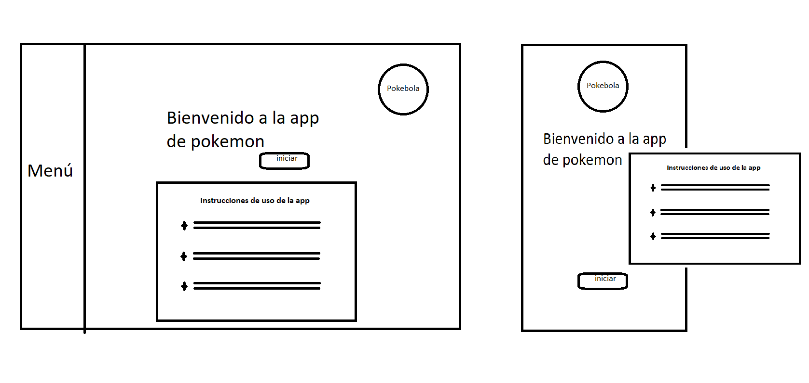
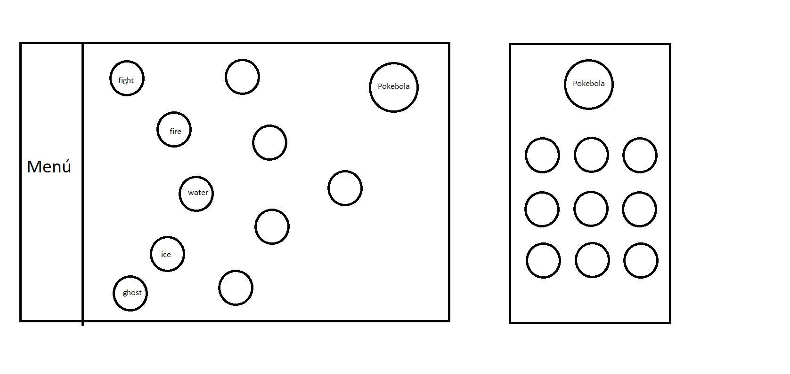
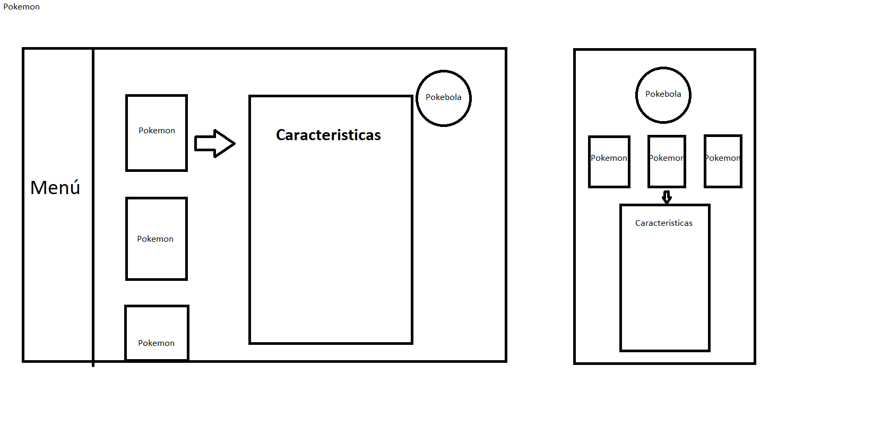

# PokeApp

## Objetivo

Este desarrollo esta dirigido a todo tipo de publico, que quiera aprender sobre pokemon, sus personajes para distraerse y pasar tiempo de ocio.

## Historias de usurio

- Yo : como jugador 
- Quiero: ver información sobre los pokemon. 
- Para: Conocer sus características y buscar los que mas me gustan en el Pokemon Go.

- yo: como usuario. 
- Quiero: ver los tipos de los pokemon. 
- Para: Elegir el mas adecuado en cada batalla.

- Yo: como jugador. 
- Quiero: Saber las caracteristicas mas importantes de cada pokemon. 
- Para: conocerlos mejor.

## Prototipo de alta fidelidad

https://www.figma.com/file/XOkhphWSkT9dQU0Ke0AIS6/Untitled?node-id=0%3A1

## Diseño final

